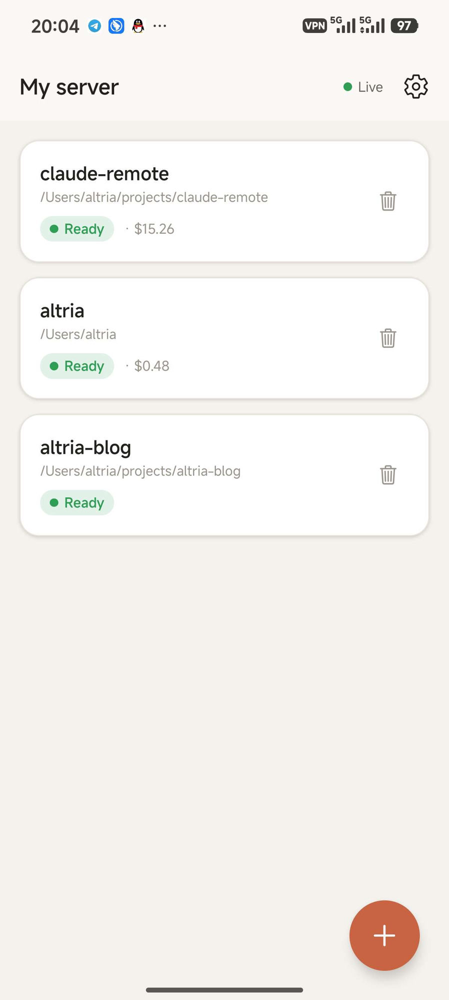
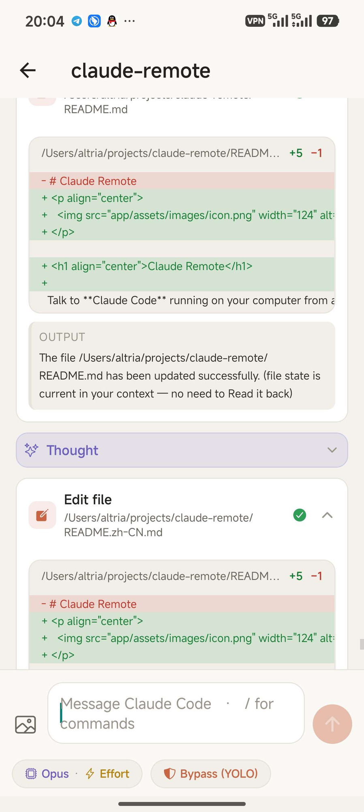
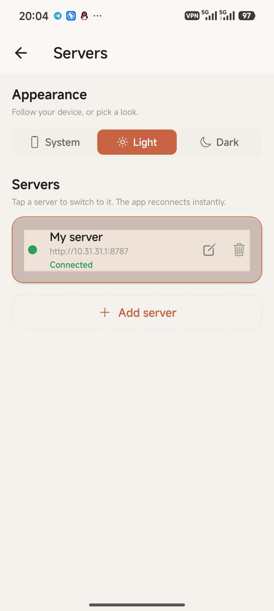

<p align="center">
  
</p>

<h1 align="center">Claude Remote</h1>

用一个现代的 Android 原生 App，远程操控运行在你电脑上的 **Claude Code**。
一个轻量的 Node 服务驱动 [Claude Agent SDK]（与 `claude` CLI 同一引擎），
通过 HTTP + WebSocket 暴露出来；Expo App 在局域网内连接。

```
┌──────────────┐        HTTP + WebSocket        ┌────────────────────────────┐
│  Expo App    │ ─────────────────────────────▶ │  Server (Node + TS)        │
│  (Android)   │ ◀───────────────────────────── │   Claude Agent SDK ↔ claude │
└──────────────┘   sessions · stream · approve   └────────────────────────────┘
```

## 截图

<p align="center">
  
  &nbsp;&nbsp;
  
  &nbsp;&nbsp;
  
</p>

<p align="center">
  <sub>按项目分的会话（成本 / 状态）· 实时对话含 diff·思考·工具调用·逐条审批 · 多服务器 + 明暗主题</sub>
</p>

## 功能简介

- 💬 通过局域网与 Claude Code 聊天 —— 多轮对话，流式输出。
- 🧠 渲染**思考过程**、回复（Markdown）、工具调用、命令输出，以及
  **以 diff 呈现的代码改动**。
- ✅ 在手机上**逐条批准或拒绝**每个命令 / 文件编辑，支持
  「永远允许此工具」开关，以及按会话切换的权限模式
  （Ask · 自动接受编辑 · Bypass · Plan）。
- ❓ 把 Claude 的**澄清问题渲染成选项卡**（单选或多选，
  并支持「Other」自由文本作答）。
- 🗂 **新会话通过浏览服务端文件系统来选择工作目录** —— 无需手输路径，
  还能就地新建文件夹。
- 🖼 随消息一起**发送图片**，并提供 **`@file` 提及自动补全**，
  在你输入时浏览项目目录树。
- 📎 **Claude 可以把文件下发到你的手机**（`send_file`）—— 以下载卡片形式出现，
  经鉴权端点获取字节（服务端真实路径绝不外泄）。
- ⚙️ **在会话进行中切换模型、推理强度（effort）和权限模式。**
- 🎛 引擎所支持的 slash 命令、模型与子代理的**命令面板**。
- 📊 **`/context` 与 `/usage`** 渲染为原生卡片（token 预算、成本、
  速率限制窗口）。
- ➕ 创建、⏸ 恢复（resume）、🗑 删除会话。
- 🌐 保存**多个服务器档案**（家里的 Mac、工作笔记本）并快速切换。
- 🔌 服务**开机/登录自启**（macOS 用 launchd，Linux 用 systemd）。

## 仓库布局

```
claude-remote/
├── server/      Node + TypeScript 服务（Claude Agent SDK 封装）
├── app/         Expo / React Native App（expo-router, TypeScript）
├── install/     自启安装器（launchd / systemd）
├── PROJECT_OVERVIEW.md   完整架构与设计说明
└── README.md
```

---

## 1. 服务端（Server）

需要 Node 18+ 以及一个已登录的 `claude` CLI（`claude` → `/login`）。无需 API key
—— 它复用你的 Claude Code 订阅鉴权。

```bash
cd server
npm install
npm run dev        # 开发模式（tsx，热重载）
#   或
npm run build && npm start   # 生产模式
```

启动时它会打印你要填进 App 的 **URL** 与**访问 token**，例如：

```
  Listening on 0.0.0.0:8787
  Connect the app to one of:
    http://192.168.1.20:8787
  Access token:  Xy3...   (also saved to ~/.claude-remote/config.json)
```

### 开机/登录自启

```bash
bash install/install.sh      # 构建 + 安装服务，并打印 URL 与 token
bash install/uninstall.sh    # 之后用它卸载
```

- **macOS** → `~/Library/LaunchAgents/com.claude-remote.server.plist`
- **Linux** → `~/.config/systemd/user/claude-remote.service`
  （想在未登录时也能真正开机启动：`sudo loginctl enable-linger $USER`）

### 配置（`~/.claude-remote/config.json`，或环境变量）

| 环境变量 | 默认值 | 含义 |
|---|---|---|
| `CLAUDE_REMOTE_PORT` | `8787` | 监听端口 |
| `CLAUDE_REMOTE_HOST` | `0.0.0.0` | 绑定地址 |
| `CLAUDE_REMOTE_TOKEN` | *(自动生成)* | App 必带的 Bearer token |
| `CLAUDE_REMOTE_CLAUDE_PATH` | *(自动探测)* | `claude` 二进制路径 |
| `CLAUDE_REMOTE_DATA_DIR` | `~/.claude-remote` | 配置 + 会话元数据 |
| `CLAUDE_REMOTE_MAX_LIVE` | `12` | 常驻活跃会话上限（空闲的按 LRU 驱逐） |

> 默认情况下服务会加载你真实的 Claude Code 设置
> （`settingSources: ['user', 'project', 'local']`），因此你的 skills、plugins 和
> 自定义 slash 命令都可用。置为 `[]` 可改为隔离运行。

---

## 2. App

需要 [Expo](https://expo.dev) 工具链。最简单的是用 **Expo Go**
（所用到的原生模块都已内置其中）：

```bash
cd app
npm install
npx expo start              # 用手机上的 Expo Go 扫描二维码
# 或构建原生 dev/release App：
npx expo run:android        # 需要 Android SDK + 设备/模拟器
```

在 App 里：

1. 打开 **Server**（齿轮图标）→ 填入服务端日志里的 URL + token →
   *Test & Connect*。
   - 真机：用你电脑的局域网 IP，例如 `http://192.168.1.20:8787`。
   - Android 模拟器：用 `http://10.0.2.2:8787`。
2. 点 **＋**，浏览到某个文件夹，选一个权限模式，**Start**。
3. 开始聊天。命令和问题弹出时随手批准/作答即可。

> 手机与电脑必须在同一网络，且服务端口（8787）必须可达
> （需在防火墙放行）。

---

## 工作原理（给 hacker 的笔记）

- 服务端为每个会话保持**一个常驻的 `query()`**（streaming-input 模式）。
  SDK session id、工作目录与元数据持久化到 `~/.claude-remote/sessions.json`；
  转写历史本身存在标准的 Claude Code 会话库中，并在恢复时回放。
  内存里最多保持 `maxLiveSessions` 个会话处于热态；空闲的按 LRU 关闭，
  并在下次 attach 时懒恢复。
- **权限**用 `PreToolUse` hook 来执行，把 allow/deny 决定往返给 App。
  （刻意避开 SDK 的 `canUseTool` 回调路径 —— 在当前 SDK 构建里它会崩溃。）
- **澄清卡片**用一个自定义的进程内 MCP 工具 `ask_user`（已预批准），
  从而完全掌控问答往返；内置的 `AskUserQuestion` 工具被禁用。
- **文件下发**用第二个进程内 MCP 工具 `send_file`：字节按一个不透明的
  `fileId` 暂存，经 `GET /api/sessions/:id/files/:fileId` 获取 ——
  服务端真实路径绝不离开进程。
- 线协议在 `server/src/protocol.ts` 中定义一次，并镜像到
  `app/src/api/protocol.ts`。

完整的架构深入说明见 [`PROJECT_OVERVIEW.md`](PROJECT_OVERVIEW.md)。

[Claude Agent SDK]: https://www.npmjs.com/package/@anthropic-ai/claude-agent-sdk
